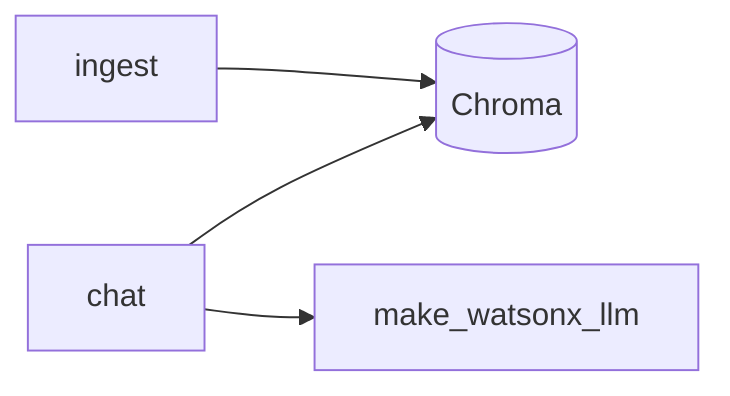
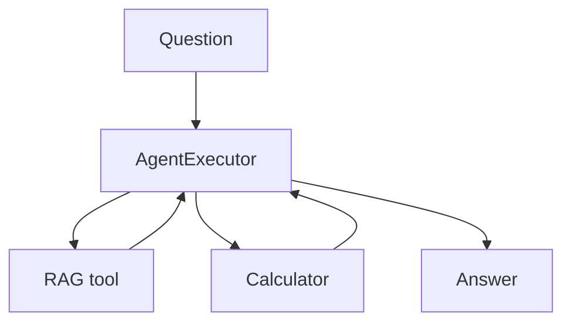

# Capstone Code Guide — CRS 001 companion projects

**Location:** `D:\Workarea\learning\playground\langchain\capstone\`  
**Status (2026-06-19):** Capstones 1–4 complete · Capstone 5 deferred  
**Flows:** [exercise_and_capstone_flows.md](../study_pages/exercise_and_capstone_flows.md)  
**Bubble map:** [crs_001_capstone_flows.html](../bubbles/outputs/crs_001_capstone_flows.html)

---

## Before every run

```powershell
D:\py_venv\rag_application_builder_foundation\set_env.ps1
cd D:\Workarea\learning\playground\langchain
```

**LLM entry:** `from watson_llm import make_watsonx_llm` (local OpenAI shim) · agents use `make_watsonx_agent_llm()`.

---

## Capstone 01 — RAG Tutor

| File | Role |
|------|------|
| `capstone_01_ingest.py` | Load PDFs → split → embed → Chroma (`chroma_01_openai`) |
| `capstone_01_chat.py` | Retrieve → prompt \| llm → answer |
| `capstone_shared.py` | Paths, collection name |
| `capstone01.md` | Bite-by-bite build log |



**Re-ingest:** `python capstone_01_ingest.py --corpus --force`

---

## Capstone 02 — Review Desk

| File | Role |
|------|------|
| `capstone_02_review_desk.py` | Sequential: sentiment → summary → customer reply |
| `capstone02.md` | Guide |

Fixed multi-step chain — **not** an agent.

---

## Capstone 03 — Remember-Me Chat

| File | Role |
|------|------|
| `capstone_03_remember_me_chat.py` | `session_id` → load/save history → chat |
| `data/chat_memory.json` | Dev persistence |
| `capstone03.md` | Guide |

Same **session_id** pattern as production FastAPI chat (see course complete doc).

---

## Capstone 04 — Research Agent

| File | Role |
|------|------|
| `capstone_04_research_agent.py` | ReAct agent, `search_course_docs` + `calculator` |
| `capstone04.md` | Guide, traps, smoke tests |



**Trap:** Agent LLM needs `make_watsonx_agent_llm()` (stop sequences / gpt-5 fallback).

---

## Capstone vs Module 3 lab

| | Module 3 Flask lab | Capstones |
|--|-------------------|-----------|
| **Goal** | Multi-model JSON API | Practice apps |
| **Provider** | Real watsonx (Cloud IDE) | Local OpenAI shim |
| **Pattern** | `model.py` utility + HTTP | CLI / REPL |
| **RAG** | No | Capstone 01, 04 tool |
| **Agent** | No | Capstone 04 |

---

## Index

Full capstone index: [playground/.../capstones.md](../../../playground/langchain/capstone/capstones.md)