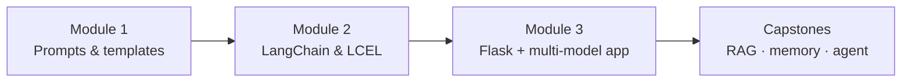
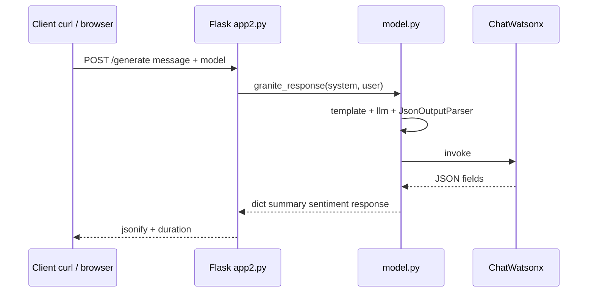

# CRS 001 — Course Complete (Sean)

**Certificate:** Develop Generative AI Applications: Get Started (IBM / Coursera)  
**Completed:** 2026-06-19  
**Canonical path:** `courses/crs_001_develop_generative_ai_applications_get_started/`

---

## Documentation map

| Layer | Where | Purpose |
|-------|--------|---------|
| Theory guides | [field_guide.md](field_guide.md) · [chapter 03 HTML](chapter_03_build_a_generative_ai_application_with_langchain_field_guide.html) | Mermaid flows in ch.3 guide |
| Code patterns | [langchain_code_patterns.md](langchain_code_patterns.md) | Copy-paste skeletons |
| Exercise catalog | [../lab/CODE_CATALOG.md](../lab/CODE_CATALOG.md) | All 36 runnable scripts |
| Capstone guide | [../docs/CAPSTONE_CODE_GUIDE.md](../docs/CAPSTONE_CODE_GUIDE.md) | 4 playground projects |
| Module 3 evidence | [../source_material/module3/LAB_DOCKET.md](../source_material/module3/LAB_DOCKET.md) | Cloud IDE run log |
| Flow charts | [exercise_and_capstone_flows.md](exercise_and_capstone_flows.md) | Mermaid use-case flows |
| Bubbles | [../bubbles/index.html](../bubbles/index.html) | Visual concept + code maps |
| RemNote import | [../source_cards/README.md](../source_cards/README.md) | Spaced repetition |

---

## Course arc (three modules)



| Module | You proved it with |
|--------|-------------------|
| **1** | Labs `01`–`04` — PromptTemplate, ChatPromptTemplate, few-shot |
| **2** | Labs `05`–`13` — LCEL, parsers, parallel, history |
| **3** | `lab/python/module3/` + `genai_flask_app/` — watsonx, JSON, Flask `/generate` |
| **Beyond course** | `playground/langchain/capstone/` — RAG, review desk, memory, ReAct agent |

---

## End-to-end delivery flow (Module 3)

What the Coursera lab builds — matches your `app2.py` stack:



**File roles:** `config.py` = IDs · `model.py` = AI utility · `app2.py` = HTTP door · `llm_test.py` = sanity check without Flask.

---

## Invoke trio (carry everywhere)

```text
prompt.invoke  →  prepare formatted input
model.invoke   →  call the LLM once
chain.invoke   →  run prompt | model | parser
```

---

## Quiz vs real world (remember)

| Quiz wording | Real practice (your labs) |
|--------------|---------------------------|
| Fine-tune for domain | RAG + prompt templates + few-shot first |
| Data sovereignty | On-prem / private deploy — not external APIs |
| Same prompt across models | `llm_test.py` / controlled comparison |
| JSON for workflows | `AIResponse` + `JsonOutputParser` |

---

## Next course in specialization

Course 2 — RAG-focused (you already have Capstone 01 RAG tutor as head start).