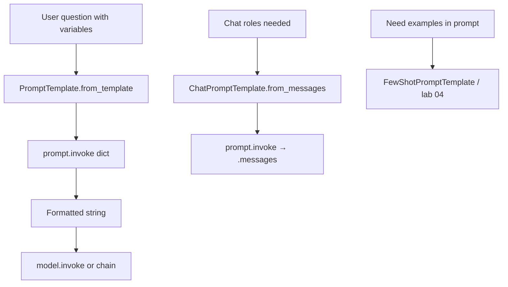
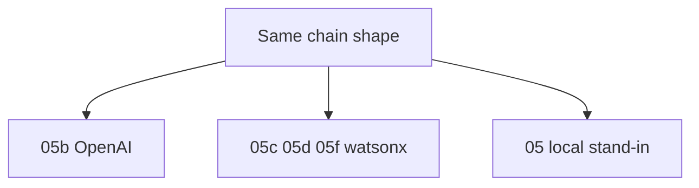
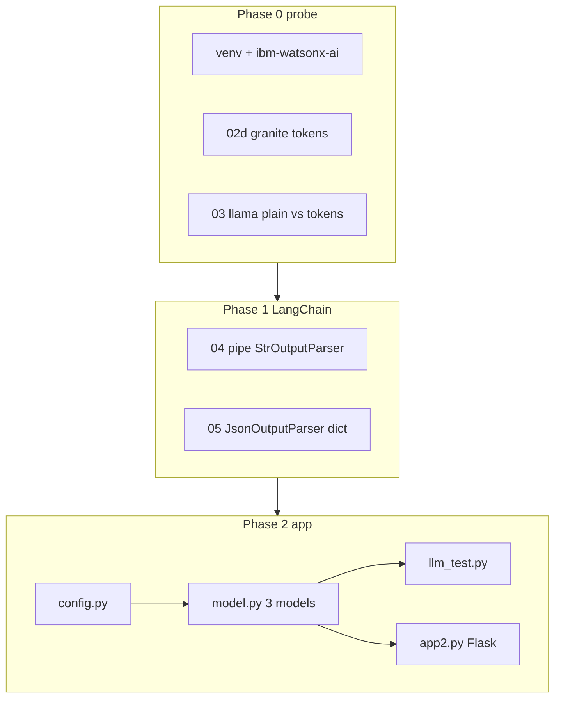
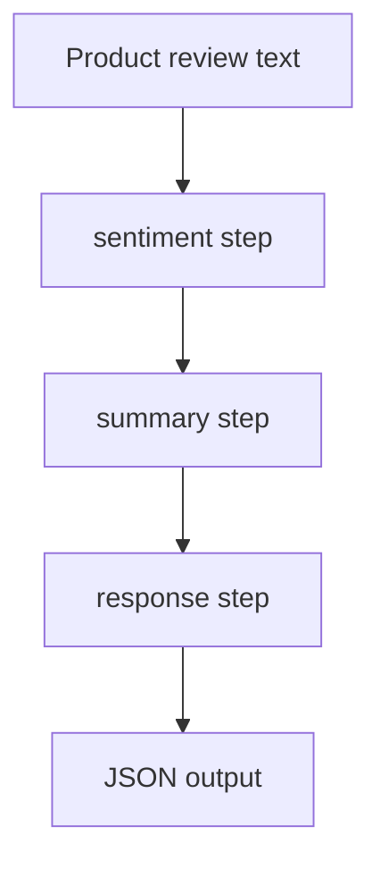
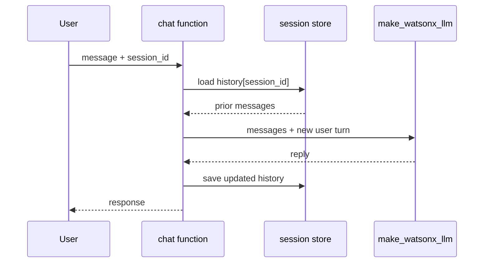
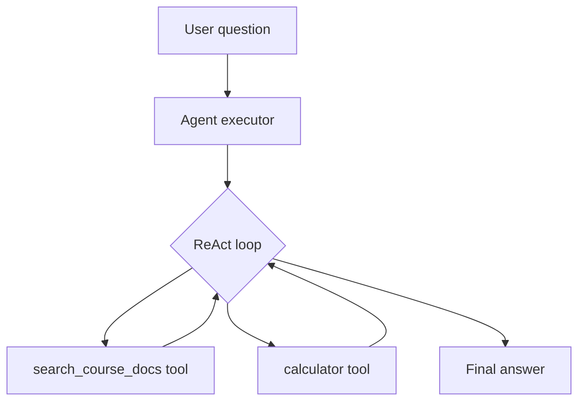
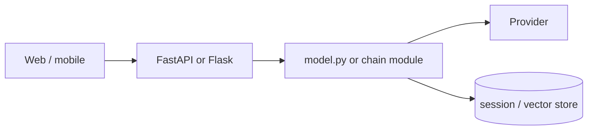

# Exercise & Capstone Flow Charts — CRS 001

Mermaid diagrams for **use-case flow**. Pair with [CODE_CATALOG.md](../lab/CODE_CATALOG.md) for file names.

---

## Module 1 — Prompt layer



**Labs:** `01` → `02` → `03` → `04`

---

## Module 2 — LCEL pipeline

```mermaid
flowchart LR
  subgraph build [Build order]
    T[Define template with vars] --> PT[PromptTemplate]
    PT --> P[prompt]
    P --> M[model adapter]
    M --> PAR[StrOutputParser or JsonOutputParser]
    PAR --> CH[chain = p | m | par]
  end
  CH --> INV[chain.invoke input dict]
  INV --> OUT[text or dict]
```

**Provider branch:**



**Labs:** `05` → `05b`/`05c`/`05d`/`05f` → `06` parallel → `07`–`09` parsers → `10`–`13` history

---

## Module 3 — Cloud IDE → Flask app



**Auth trap:** `Credentials(url only)` + `project_id=skills-network` — no `api_key` in code on SN.

---

## Capstone 01 — RAG Tutor

```mermaid
flowchart LR
  subgraph ingest [capstone_01_ingest.py]
    PDF[PDFs / corpus] --> LOAD[load split]
    LOAD --> EMB[embed]
    EMB --> CHROMA[(Chroma)]
  end
  subgraph chat [capstone_01_chat.py]
    Q[User question] --> RET[retrieve top-k]
    RET --> CTX[stuff context]
    CTX --> QA[prompt | llm]
    QA --> A[Answer]
  end
  CHROMA --> RET
```

---

## Capstone 02 — Review Desk



Multi-step chain — fixed order, not an agent.

---

## Capstone 03 — Remember-Me Chat



---

## Capstone 04 — Research Agent (ReAct)



**Not** fixed RAG every time — LLM picks tool from description.

---

## Production pattern (after course)



Same separation you built in Module 3: **HTTP thin**, **model utility thick**.