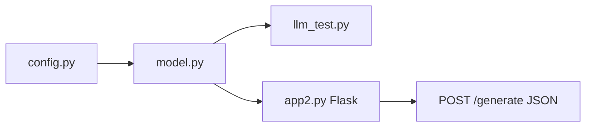

# Develop Generative AI Applications: Get Started — Field Guide

**Status:** Course complete · certificate earned 2026-06-19  
**Completion hub:** [COURSE_COMPLETE.md](COURSE_COMPLETE.md) · **Flows:** [exercise_and_capstone_flows.md](exercise_and_capstone_flows.md)

## Course flow

```text
Foundation models and LLMs
→ prompt engineering and templates
→ LangChain components and LCEL
→ structured output and reusable chains
→ model evaluation and Flask delivery
→ monitoring and refinement
```

## Module guides

1. [Module 1 — Generative AI, Prompt Engineering, and Prompt Templates](chapter_01_generative_ai_prompt_engineering_and_prompt_templates_field_guide.html)
2. [Module 2 — Introduction to LangChain](chapter_02_introduction_to_langchain_in_generative_ai_applications_field_guide.html)
3. [Module 3 — Build a Generative AI Application](chapter_03_build_a_generative_ai_application_with_langchain_field_guide.html)

## Core ideas

- A **foundation model** is broadly trained and reusable across many tasks.
- An **LLM** is a language-focused foundation model.
- **Prompt engineering** controls runtime behavior through instructions, context, examples, constraints, and output requirements.
- **LangChain** organizes application components; it does not make the model inherently smarter.
- **LCEL** expresses reusable data flow with runnable components.
- **Structured output** gives downstream code predictable fields and validation.
- **Flask** exposes the AI workflow through web routes and HTTP responses.

## Core memory rules

```text
prompt.invoke → prepare input
model.invoke  → generate a response
chain.invoke  → run the connected workflow
```

```text
dependent steps   → sequence
independent steps → parallel
```

## Supporting guides

- [Concept and Code Quick Lookup](concept_and_code_quick_lookup.html)
- [LangChain Code Patterns](langchain_code_patterns.html)
- [Code Catalog (36 exercises)](../lab/CODE_CATALOG.md)
- [Capstone Code Guide](../docs/CAPSTONE_CODE_GUIDE.md)
- [Module 3 LAB_DOCKET](../source_material/module3/LAB_DOCKET.md)
- [Chapter 1 Learning Evidence](chapter_01_learning_evidence.md)
- [Certification Review Digest](certification_review_digest.html)
- [Certification Self-Test](certification_self_test.html)
- [Study Bubbles](../bubbles/index.html)

## Module 3 delivery (completed)



Sean proved stack via `curl` on Skills Network (browser preview optional).
