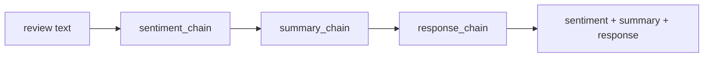
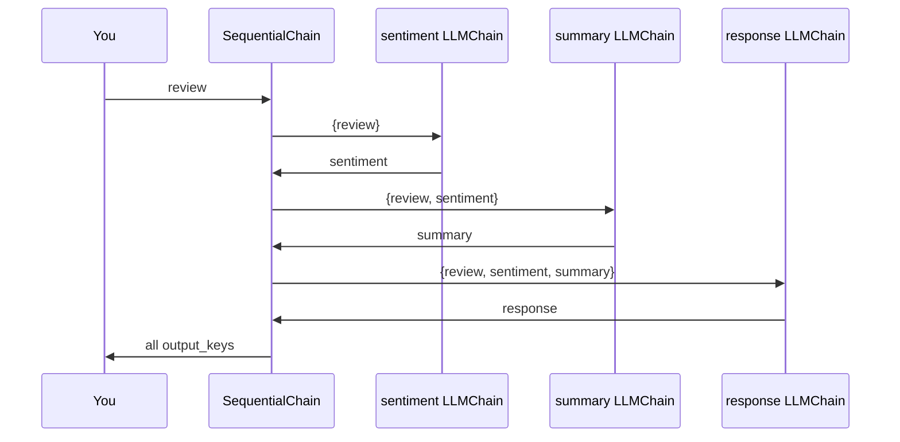
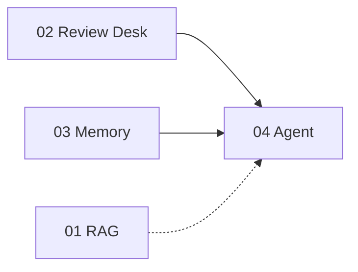

# Capstone 02 — Structured Review Desk

← [All capstones](capstones.md) · Before: [Capstone 01](capstone01.md) · [Capstone 03](capstone03.md)

**One script** — paste a **product review** → run a **3-step LLM pipeline** → sentiment, summary, suggested customer reply.

| Script | Job | When you run it |
|--------|-----|-----------------|
| **`capstone_02_review_desk.py`** | **SequentialChain** (or LCEL stretch) over one review | Per review — no database, no memory |

**Not in this capstone:** Chroma, ingest, embeddings, conversation memory.

---

## Story (layman)

**Capstone 01:** Librarian finds pages, one answer.  
**Capstone 03:** Assistant remembers your chat.  
**Capstone 02:** **Assembly line** — same review passes three workstations:

1. **Sentiment** — positive / negative / neutral  
2. **Summary** — bullet key points  
3. **Response** — draft reply to the customer  

Each step gets the **original review** plus **outputs from earlier steps**.

---

## What problem multi-step chains solve

One giant prompt (“do everything”) is hard to debug and inconsistent.

**Pipeline:** small prompts, each with one job. Step 2 sees step 1’s label; step 3 sees both.

```
review only  →  sentiment
review + sentiment  →  summary
review + sentiment + summary  →  response
```

**Layman:** Factory line — each station adds one labeled part to the package before the next station opens it.

---

## Capstone 01 / 03 / 02 (do not mix them up)

| | **01 RAG** | **03 Memory** | **02 Review Desk** |
|--|------------|---------------|---------------------|
| **Input** | Question | Chat turns | One review text |
| **Steps** | Retrieve → 1 LLM | Memory + 1 LLM | **3 LLMs in sequence** |
| **State** | Chroma on disk | RAM buffer | **Pass dict between chains** |
| **Output** | Answer from docs | Conversational reply | **Structured fields** |
| **Shared** | `capstone_shared` | `watson_llm` only | **`watson_llm` only** |

---

## Pipeline (traditional — recommended for bites)



### Inside `SequentialChain.invoke({"review": "..."})`



LangChain passes **output_key** from each `LLMChain` into the next prompt’s variables automatically.

---

## LangChain pieces you will use

| Component | Import | Role |
|-----------|--------|------|
| **`make_watsonx_llm`** | `watson_llm` | LLM for each step |
| **`PromptTemplate`** | `langchain_core.prompts` | 3 templates (sentiment, summary, response) |
| **`LLMChain`** | `langchain_classic.chains` | One prompt + LLM + `output_key` |
| **`SequentialChain`** | `langchain_classic.chains` | Run chains in order; wire variables |
| **`GenParams`** | `ibm_watsonx_ai.metanames` | `TEMPERATURE: 0.2` |

**Stretch:**

| Component | Role |
|-----------|------|
| `JsonOutputParser` | Last step returns `{tone, response}` JSON (Lab 11 / 22) |
| LCEL `RunnablePassthrough.assign` | Same pipeline without `SequentialChain` (Lab 34 bite 9) |
| `StrOutputParser` | LCEL: LLM string out |

**Modules:** [01](../../../reference/langchain/modules/01-prompt-templates.html) · [03](../../../reference/langchain/modules/03-llm-chain.html) · [11](../../../reference/langchain/modules/11-output-parsers.html) · [18](../../../reference/langchain/modules/18-sequential-chain.html)

**Labs:** `34.chains.py` (bites 7–9 = Exercise 6) · `21.output_parsers.py` · `22.exercise2.movie_json.py` (JSON stretch)

---

## Utilities — what you import from where

```text
watson_llm.py     → make_watsonx_llm()
sys.path bootstrap  → parent playground/langchain/ (same as Capstone 03)
capstone_shared.py  → NOT used (no RAG)
```

**Needs:** `set_env.ps1` + **network** (3 LLM calls per review).

---

## Prompt templates (from Lab 34 Exercise 6)

Copy and tune from `34.chains.py` — three templates:

| Step | `input_variables` | Teaches model to |
|------|-------------------|------------------|
| **Sentiment** | `review` | Label positive / negative / neutral |
| **Summary** | `review`, `sentiment` | 3–5 bullet key points |
| **Response** | `review`, `sentiment`, `summary` | Draft customer reply |

Sample reviews (positive coffee maker, negative laptop) live in Lab 34 — use for smoke tests.

---

## Script — `capstone_02_review_desk.py` (you type this)

**Mirror lab:** `playground/langchain/34.chains.py` bites 7–8 first (traditional); bite 9 optional.

**Pipeline:** 3 prompts → 3 `LLMChain` → 1 `SequentialChain` → print results

| Bite | You build |
|------|-----------|
| 1 | Docstring + `sys.path` + imports (`LLMChain`, `SequentialChain`, `PromptTemplate`, `make_watsonx_llm`) |
| 2 | `LLM_PARAMS` + `make_llm()` smoke test |
| 3 | Three `PromptTemplate`s (sentiment, summary, response) |
| 4 | Three `LLMChain`s with `output_key`: `sentiment`, `summary`, `response` |
| 5 | `build_review_chain()` → `SequentialChain(chains=[...], input_variables=["review"], output_variables=[...])` |
| 6 | `analyze_review(chain, review: str) -> dict` → `invoke` → return dict |
| 7 | `main()` — REPL: paste review (one paragraph); print 3 outputs; `quit` |
| 8 | *(optional)* Wire Lab 34 sample reviews — skip if you tested via REPL |

**Stretch bites (optional — skip if REPL is enough):**

| Bite | You build |
|------|-----------|
| S1 | `argparse`: `--review "..."` one-shot \| default REPL |
| S2 | Last step: `JsonOutputParser` → `{tone, response}` instead of free text |
| S3 | `--file reviews.txt` batch (one review per blank-line block) |
| S4 | LCEL version of same pipeline (compare to `SequentialChain`) |

---

## Run order (once script exists)

```powershell
D:\py_venv\rag_application_builder_foundation\set_env.ps1
cd D:\Workarea\learning\playground\langchain\capstone

python capstone_02_review_desk.py
```

Paste a review at the prompt; `quit` to exit. (No CLI — stretch S1 not built.)

---

## Test scenarios

| # | Input | Expect |
|---|--------|--------|
| 1 | Positive coffee review (Lab 34) | Sentiment positive-ish; thankful response |
| 2 | Negative laptop review (Lab 34) | Sentiment negative-ish; empathetic response |
| 3 | Neutral one-liner | All three steps complete (no crash) |

**Out of scope:** “What is RAG?” — no retrieval; model only sees the **review** you paste.

---

## Traps

| Symptom | Cause | Fix |
|---------|-------|-----|
| `KeyError: 'sentiment'` | Prompt variable name ≠ `output_key` / chain order | Match Lab 34 names exactly |
| Step 3 ignores step 1 | Wrong `input_variables` on `SequentialChain` | Only `["review"]` — rest flow via `output_key` |
| Empty or garbled JSON (stretch) | Weak format instructions | Copy Lab 22 `format_instructions` pattern |
| 3× slow | By design | 3 sequential LLM calls — not a bug |
| Used `capstone_01_chat` | Wrong app | Review desk = **pipeline**, not RAG |

---

## SequentialChain vs LCEL (pick one for core)

| | **SequentialChain** (bites 4–5) | **LCEL** (stretch S4) |
|--|--------------------------------|------------------------|
| Style | Classic course / Lab 34 bite 8 | Modern pipes `prompt \| llm \| parser` |
| Wiring | `output_key` automatic | `RunnablePassthrough.assign` manual |
| Learning | Easier to read step list | Closer to production LangChain |

**Recommendation:** type **SequentialChain** first; add LCEL as stretch after it works.

---

## Relationship to other capstones



Capstone 04 may use a **tool** that runs a small chain like this plus RAG.

---

## Done when

- [x] One review → three outputs printed (sentiment, summary, response)
- [x] Tested positive + negative reviews (REPL paste — Bite 8 constants optional)
- [ ] You can draw the 3-step pipeline on paper
- [ ] One sentence: **SequentialChain vs single RetrievalQA**
- [ ] One sentence: **why step 2 needs sentiment from step 1**

**Status:** Bites 1–7 shipped in `capstone_02_review_desk.py`. Bite 8 + stretch (CLI, JSON, LCEL) skipped by choice.

**Provider:** LLM via `make_watsonx_llm` → OpenAI (`set_env.ps1`). Details: [PROVIDER_SWAP_WATSON_TO_OPENAI.md](../PROVIDER_SWAP_WATSON_TO_OPENAI.md).

← [capstones.md](capstones.md)