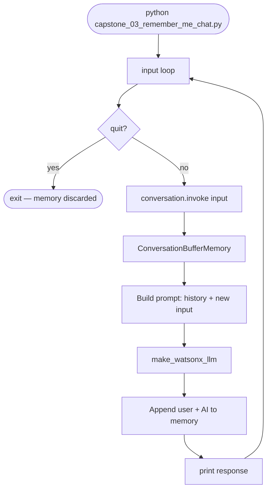
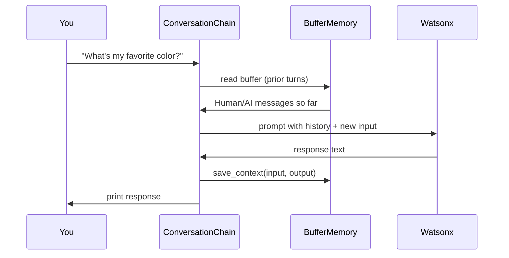
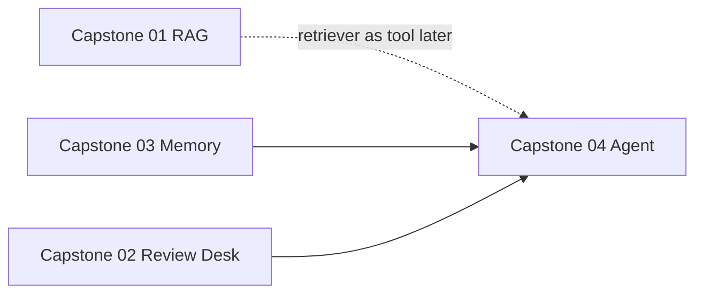

# Capstone 03 — Remember-Me Chat

← [All capstones](capstones.md) · Before this: [Capstone 01](capstone01.md) (RAG — separate skill)

**One script** — REPL chat that **remembers** your name, preferences, and prior turns inside the session.

| Script | Job | When you run it |
|--------|-----|-----------------|
| **`capstone_03_remember_me_chat.py`** | **ConversationChain** + **buffer memory** → multi-turn chat | Whenever you want a stateful assistant |

**Not in this capstone:** Chroma, ingest, retrieval, embeddings. Memory lives in **RAM** for the running process.

---

## Story (layman)

**Capstone 01:** Librarian pulls index cards from a **filing cabinet** (Chroma) you built earlier.

**Capstone 03:** Assistant keeps a **notepad** of everything you said **this sitting**. Each new message, they re-read the notepad + your latest line, then answer.

Quit the script? RAM notepad is gone — unless you used **`--save`** (JSON on disk). Still no vectors.

---

## What problem memory solves

LLMs are **stateless**. Each API call only sees what you **send in that call**.

Without memory:

```
You:  My name is Sean.
AI:   Hi Sean!
You:  What's my name?
AI:   I don't know.   ← only the last question was sent
```

With **`ConversationBufferMemory`**:

```
Each turn sends:  [full chat history] + [new message]
AI can answer:    What's my name? → Sean
```

That history list is the **session cache** — not Chroma, not embedding search.

---

## Capstone 01 vs 03 (do not mix them up)

| | **Capstone 01 — RAG** | **Capstone 03 — Memory** |
|--|------------------------|---------------------------|
| **Remembers** | Facts in **documents** | **Your conversation** |
| **Storage** | Chroma on disk (vectors + text) | Python list in RAM |
| **Search** | Cosine / MMR on embeddings | None — full history in prompt |
| **Survives `quit`?** | Yes (Chroma on disk) | **RAM: no** · **`--save`/`--load`: yes** |
| **Shared code** | `capstone_shared.py` | **`watson_llm.py` only** (typical) |
| **LangChain chain** | `RetrievalQA` | `ConversationChain` |

You can combine both later (Capstone 4/5). **This project is memory only.**

---

## How it will work (pipeline)



### Inside one `invoke()`



---

## LangChain pieces you will use

| Component | Package / import | Role |
|-----------|------------------|------|
| **`make_watsonx_llm`** | `watson_llm` (Route B) | LLM for replies |
| **`ConversationChain`** | `langchain_classic.chains` | Wires memory + LLM + prompt |
| **`PromptTemplate`** | `langchain_classic.prompts` | `CAPSTONE_PROMPT` — one short reply, no fake turns |
| **`ConversationBufferMemory`** | `langchain_classic.memory` | Stores full transcript (`--memory buffer`) |
| **`ConversationSummaryMemory`** | `langchain_classic.memory` | LLM-compressed history (`--memory summary`) |
| **`ChatMessageHistory`** (optional) | `langchain_community.chat_message_histories` | Seed demo / Exercise 5 style |
| **`GenParams`** | `ibm_watsonx_ai.metanames` | Temperature, max tokens |

**Optional later (not in script):**

| Component | Role |
|-----------|------|
| `ConversationBufferWindowMemory` | Keep only last **K** turns |

**Modules:** [07](../../../reference/langchain/modules/07-watson-helpers.html) · [09](../../../reference/langchain/modules/09-llm-params.html) · [10](../../../reference/langchain/modules/10-prompt-templates.html) · [17](../../../reference/langchain/modules/17-memory.html)

**Labs:** `33.memory.py` (primary) · spirit of `20` (chat templates)

---

## Utilities — what you import from where

```text
watson_llm.py              → make_watsonx_llm()     # parent: playground/langchain/
capstone_shared.py         → NOT required for 03    # RAG-only; skip unless you reuse later
```

**Import trap:** `watson_llm` is not inside `capstone/`. Bite 1 adds a small `sys.path` bootstrap (same idea as `capstone_shared.py`) so imports work when you run from `capstone/`.

**Needs:** `set_env.ps1` + **network** (Watsonx LLM each turn). No embeddings API for core path.

---

## Memory types (know before you stretch)

| Type | Compresses? | Good for |
|------|-------------|----------|
| **`ConversationBufferMemory`** | **No** — full text every turn | Learning, short REPL, Capstone 03 core |
| **`ConversationBufferWindowMemory`** | Drops old turns (keep last K) | Long chat, fixed window |
| **`ConversationSummaryMemory`** | Summarizes old turns | Long chat, save tokens |

**Trap:** 5 hours / hundreds of prompts with **buffer only** → prompt explodes → slow, costly, errors, or model “forgets” old stuff. Plan summary or window for production; buffer is fine for capstone demo.

---

## Script — `capstone_03_remember_me_chat.py` (you type this)

**Mirror lab:** `playground/langchain/33.memory.py` — bites 6–10 are the spine.

**Pipeline:** LLM → `build_memory(buffer|summary)` → `ConversationChain` + `CAPSTONE_PROMPT` → REPL / demos / one-shot

| Bite | You build |
|------|-----------|
| 1 | `sys.path` bootstrap + imports (`ConversationChain`, memories, `PromptTemplate`, `make_watsonx_llm`) |
| 2 | `CHAT_LLM_PARAMS` + `make_chat_llm()` |
| 3 | `CAPSTONE_PROMPT` + `build_conversation_chain(memory_type=...)` |
| 4 | `chat_once()` → `invoke` → `response` string |
| 5 | `run_repl()` + `main()` |
| 6 | `demo_little_cat()` · CLI `--demo cat` |
| 7 | `demo_alice()` · CLI `--demo alice` |
| 8 | `peek_memory()` · demos peek by default |
| 9 | `argparse` modes: REPL \| `--demo` \| `-q` |
| 10 | `save_memory` / `load` JSON · `--save` / `--load` · `--memory summary` |

**Stretch (CLI — implemented):**

| Flag | Behavior |
|------|----------|
| `--memory buffer` | Default — full transcript (Lab 33) |
| `--memory summary` | `ConversationSummaryMemory` — compresses via LLM (Lab 33 bite 11) |
| `--save [PATH]` | Write session JSON on exit (default `data/chat_memory.json`) |
| `--load PATH` | Restore messages (+ summary replay if needed) |
| `-q` / `--question` | One-shot turn then exit |
| `--peek` | Print memory buffer at end (demos always peek) |

Modes are exclusive: **REPL** (default) **or** `--demo` **or** `-q`.

**Load rule:** if the JSON file has `memory_type`, that **wins** over CLI `--memory` (you’ll see a Note).

**Save format:** `data/chat_memory.json` — `version`, `memory_type`, `messages[]`, optional `summary`.

---

## Run order

```powershell
D:\py_venv\rag_application_builder_foundation\set_env.ps1
cd D:\Workarea\learning\playground\langchain\capstone

python capstone_03_remember_me_chat.py
python capstone_03_remember_me_chat.py --demo cat
python capstone_03_remember_me_chat.py --demo alice
python capstone_03_remember_me_chat.py --memory summary --peek
python capstone_03_remember_me_chat.py --save
python capstone_03_remember_me_chat.py --save data/chat_memory.json
python capstone_03_remember_me_chat.py --load data/chat_memory.json
python capstone_03_remember_me_chat.py -q "What is my name?" --load data/chat_memory.json
```

---

## Test scenarios (manual REPL)

Run these after bite 5. All should pass with **buffer memory**.

| # | You type | Expect |
|---|----------|--------|
| 1 | `My name is Sean.` | Acknowledges name |
| 2 | `What's my name?` | **Sean** (proves memory) |
| 3 | `My favorite color is blue.` | Acknowledges |
| 4 | `What activities do I like?` | May ask — then tell it hiking |
| 5 | `I enjoy hiking.` | Acknowledges |
| 6 | `What was my favorite color again?` | **blue** |
| 7 | `quit` | Clean exit |

**Out of scope (on purpose):** “What is RAG?” — no Chroma; model answers from **weights** only, not your capstone 01 corpus.

---

## Traps

| Symptom | Cause | Fix |
|---------|-------|-----|
| `ImportError` on memory | Wrong package path | `langchain_classic.memory` (see `01_import_probe.py`) |
| AI forgets name on turn 2 | Memory not wired to chain | `ConversationChain(..., memory=ConversationBufferMemory())` |
| `invoke` key errors | Wrong input key | `chain.invoke(input="...")` for `ConversationChain` |
| Memory “resets” mid-session | New chain each loop iteration | Build chain **once** before `while True` |
| Huge slow replies after many turns | Buffer growth | Stretch: summary or window memory |
| Expects RAG answers | Wrong capstone | Use `capstone_01_chat.py` for documents |
| Summary says “don’t know” on turn 1 | Empty summary session | Chat first or `--load` |
| `--memory summary` but file is buffer | Load uses file type | Re-save with `--memory summary` or accept buffer |
| Long run-on / fake Human lines | Default chain prompt | `CAPSTONE_PROMPT` (in code) |

---

## What LangChain means here

**Lang** = language models. **Chain** = link steps automatically.

In Capstone 03 the chain is short:

```text
memory load → prompt template → LLM → memory save
```

`ConversationChain` hides that wiring so you focus on **memory behavior**, not raw message lists (Lab 33 bite 5 shows manual history first — optional extra credit).

---

## Relationship to other capstones



**Suggested order:** 01 ✅ → **03** → 02 → 04 → 05

---

## Stretch (optional later)

- `ConversationBufferWindowMemory(k=6)` — last 3 exchanges
- Compare `--memory buffer` vs `summary` buffer sizes after long REPL

---

## Done when

- [x] REPL runs until `quit`
- [x] Turn 2 remembers something from turn 1 (name test)
- [x] `--demo cat` / `--demo alice` pass
- [x] `--save` then `--load` / `-q` recalls across processes
- [x] `peek_memory` / `--peek` shows buffer
- [x] Explain: **buffer memory vs Chroma RAG**
- [x] Explain: **RAM vs `--save` JSON**

---

## Session

**Status: complete.** Reference lab: `33.memory.py`. Optional: `capstone_03_remember_me_chat_flow.md` (like Capstone 01).

← [capstones.md](capstones.md)