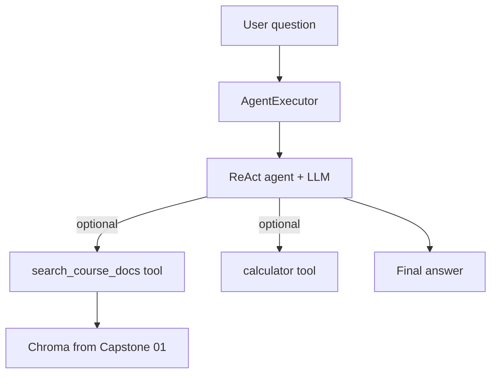
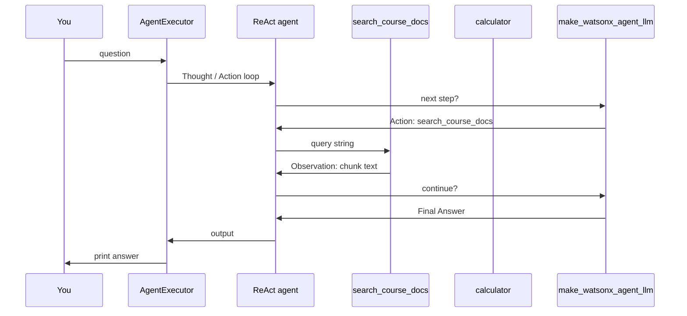

# Capstone 04 — Research Agent

← [All capstones](capstones.md) · Needs: [Capstone 01](capstone01.md) ingest done · Mirror: [Lab 35](../35.agents.py)

**One script** — you ask a question → a **ReAct agent** picks tools → answers (RAG over your corpus + a simple utility tool).

| Script | Job | When you run it |
|--------|-----|-----------------|
| **`capstone_04_research_agent.py`** | **AgentExecutor** + tools (RAG + calculator) | REPL (`quit` to exit); one-shot = stretch S1 |

**Not in this capstone:** New ingest pipeline, conversation memory, multi-step SequentialChain (that was Capstone 02).

---

## Story (layman)

**Capstone 01:** Fixed librarian — always retrieve, then answer.

**Capstone 04:** **Research assistant with a toolkit.** You ask one question; the model **decides**:

- “I need the course PDFs” → **RAG tool** (search Chroma from Capstone 01)
- “I need math” → **calculator tool** (Lab 35 Exercise 7 style)
- “I can answer from the question alone” → skip tools

**Layman:** Chain = assembly line with a fixed order. Agent = worker who reads the question and **chooses** which tool to use, maybe more than once.

---

## What problem agents solve

| Approach | You wire | Good when |
|----------|----------|-----------|
| **RetrievalQA** (Capstone 01) | Always retrieve → always LLM | Every question needs docs |
| **SequentialChain** (Capstone 02) | Step 1 → 2 → 3 always | Same pipeline every time |
| **Agent** (Capstone 04) | LLM picks tools in a loop | Question might need **RAG**, **math**, or **both** |

ReAct loop (Lab 35):

```
Question → Thought → Action (tool name) → Action Input → Observation → … → Final Answer
```

---

## Capstone 01 / 02 / 03 / 04 (do not mix them up)

| | **01 RAG** | **02 Review Desk** | **03 Memory** | **04 Agent** |
|--|------------|-------------------|---------------|--------------|
| **Who decides steps?** | You (fixed chain) | You (3 chains) | You (memory + 1 LLM) | **LLM** (tool loop) |
| **Uses Chroma?** | Yes, always | No | No | **Sometimes** (RAG tool) |
| **Uses memory?** | No | No | Yes (buffer) | No (this capstone) |
| **Shared** | `capstone_shared` | `watson_llm` only | `watson_llm` only | **`capstone_shared` + `watson_llm`** |

---

## Pipeline



### Inside one `invoke({"input": "..."})`



---

## LangChain pieces you will use

| Component | Import | Role |
|-----------|--------|------|
| **`make_watsonx_agent_llm`** | `watson_llm` | Agent brain — ReAct-safe model (OpenAI via shim) |
| **`Tool`** or **`@tool`** | `langchain_core.tools` / `langchain_classic.tools` | Wrap RAG + calculator |
| **`PromptTemplate`** | `langchain_core.prompts` | ReAct prompt (`{tools}`, `{tool_names}`, `{agent_scratchpad}`) |
| **`create_react_agent`** | `langchain_classic.agents` | Build agent |
| **`AgentExecutor`** | `langchain_classic.agents` | Run tool loop |
| **`load_vector_store`** | `capstone_shared` | Open Capstone 01 Chroma |

**Labs:** `35.agents.py` (bites 1–7, especially Exercise 7 calculator + prompt rules)

**Modules:** [16](../../../reference/langchain/modules/16-vector-stores-retrievers.html) · [19](../../../reference/langchain/modules/19-agents.html)

---

## Utilities — what you import from where

```text
watson_llm.py       → make_watsonx_agent_llm()  (not make_watsonx_llm — see Traps)
capstone_shared.py  → load_vector_store(), chroma_has_data(), CHROMA_DIR
sys.path bootstrap  → parent playground/langchain/ (same as other capstones)
```

**Needs:** `set_env.ps1` + **network** (agent = multiple LLM calls per question).

**Prerequisite:** Capstone 01 ingest on **`chroma_01_openai`** (OpenAI embeddings). If empty or you only have old **`chroma_01`** (Watson-era folder):

```powershell
python capstone_01_ingest.py --corpus --force
```

(`--force` re-embeds into `chroma_01_openai` even when the manifest says unchanged.)

---

## Tools you will build

| Tool | Purpose | Implementation hint |
|------|---------|---------------------|
| **`search_course_docs`** | Answer from your indexed PDFs | Retriever from `load_vector_store()` → return top **3** chunk texts as string (not full RetrievalQA chain) |
| **`calculator`** | Simple math | Copy `calculator()` + `_first_line()` from `35.agents.py` Exercise 7 |

**Design choice:** RAG tool returns **context string** to the agent; the agent LLM writes the final answer. Simpler than nesting a full `RetrievalQA` inside the tool.

---

## Script — `capstone_04_research_agent.py` (you type this)

**Mirror lab:** `35.agents.py` bites 1–5 + Exercise 7 tools/prompt; wire RAG from `capstone_01_chat.py` retriever settings.

| Bite | You build |
|------|-----------|
| 1 | Docstring + `sys.path` + imports + `LLM_PARAMS` + `make_llm()` → `make_watsonx_agent_llm` |
| 2 | `require_chroma()` — exit with message if no ingest (like `capstone_01_chat`) |
| 3 | `build_rag_tool(vector_store)` → `Tool` named `search_course_docs` |
| 4 | `build_calculator_tool()` — Exercise 7 `calculator` + `Tool` |
| 5 | `REACT_PROMPT` + `build_agent_executor(tools)` → `create_react_agent` + `AgentExecutor` |
| 6 | `run_question(executor, text)` + `run_smoke_tests()` — uncomment in `main()` to verify routing once |
| 7 | `run_repl(executor)` — `input()` loop; `quit` to exit (**default in `main()`**) |

**Stretch bites:**

| Bite | You build |
|------|-----------|
| S1 | `argparse`: one-shot question \| default REPL |
| S2 | Third tool: `format_text` from Lab 35 Ex 7 |
| S3 | `verbose=False` flag; print only final answer |
| S4 | Compare same question: `capstone_01_chat` vs agent — when does each win? |

---

## Run order

```powershell
D:\py_venv\rag_application_builder_foundation\set_env.ps1
cd D:\Workarea\learning\playground\langchain\capstone

python capstone_04_research_agent.py
```

Default `main()`: **REPL** — paste questions at `Q:`; `quit` or empty line to exit.

To re-verify routing once, uncomment `run_smoke_tests(executor)` in `main()` (bite 6).

---

## Test scenarios

| # | Question | Expect |
|---|----------|--------|
| 1 | `What is 25 + 63?` | Agent uses **calculator** (not RAG) |
| 2 | `What is retrieval augmented generation?` | Agent uses **search_course_docs** (if corpus covers it) |
| 3 | `What is 15 * 7 and is RAG in my course notes?` | May use **both** tools (order may vary) |
| 4 | `Hello` | May answer without tools |

**Out of scope:** Web search, new PDF ingest, long-term memory.

---

## Traps

| Symptom | Cause | Fix |
|---------|-------|-----|
| `Unsupported parameter: 'stop'` | `OPENAI_MODEL` is gpt-5.x; ReAct needs `stop` sequences | Use `make_watsonx_agent_llm()` (falls back to `gpt-4o-mini`); optional `OPENAI_AGENT_MODEL` in `set_env.ps1` |
| “No vector store” but you ingested before | Data in old **`chroma_01`**, code reads **`chroma_01_openai`** | `python capstone_01_ingest.py --corpus --force` |
| Agent loops forever | Weak ReAct prompt / bad tool output | Copy Lab 35 **Rules** block; `max_iterations=8`, `handle_parsing_errors=True` |
| `Action Input` garbage | Model emits JSON or multi-line | `_first_line()` on calculator input (Lab 35) |
| RAG tool returns nothing | Chroma empty or wrong `CHROMA_DIR` | Run ingest; check `capstone_shared.CHROMA_DIR` |
| Agent never calls RAG | Tool description vague | Description: “Search indexed course PDFs for factual answers” |
| `KeyError: agent_scratchpad` | Wrong prompt variables | ReAct template must include `{agent_scratchpad}` |
| Slow / costly | Normal | Each Thought = LLM call; agent > single RetrievalQA |
| Verbose ReAct trace noisy | `verbose=True` on `AgentExecutor` | Stretch S3: `verbose=False`; print only final answer |

---

## Agent vs fixed RAG (one sentence each)

After it works, be able to say:

- **When Capstone 01 alone is enough:** Every question needs document context.
- **When an agent helps:** Question mixes **lookup** and **computation** (or you want the model to **skip** retrieval when unnecessary).

---

## Done when

- [x] `search_course_docs` + `calculator` registered and listed in agent prompt
- [x] Math question answered via calculator tool
- [x] RAG question returns sensible answer from your corpus
- [x] REPL runs until `quit`
- [x] You can explain **ReAct** in one sentence vs **RetrievalQA**

---

## Status

**Built** — `capstone_04_research_agent.py` complete (bites 1–7). Run REPL; optional stretch bites S1–S4 above.

← [capstones.md](capstones.md)