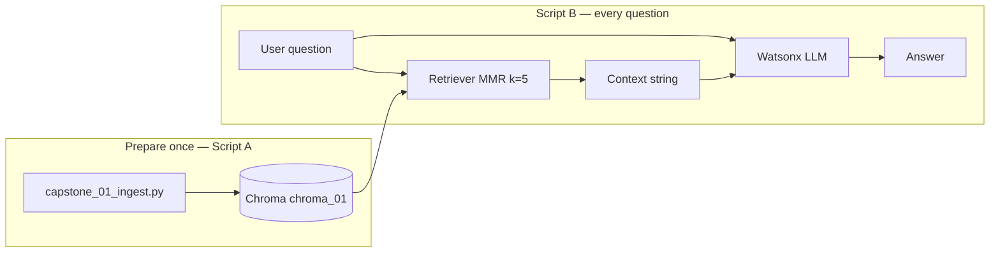
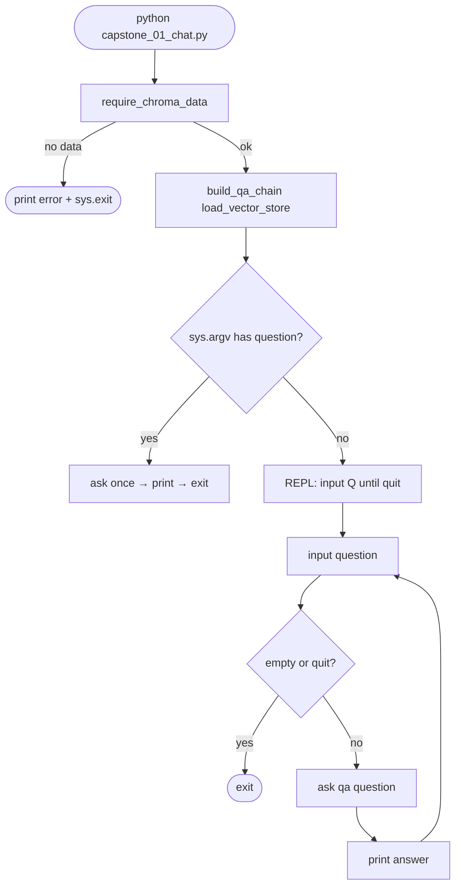
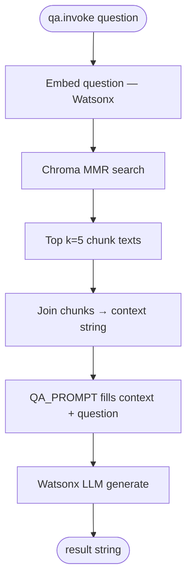
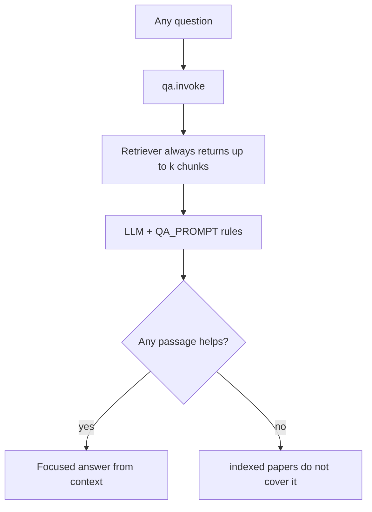
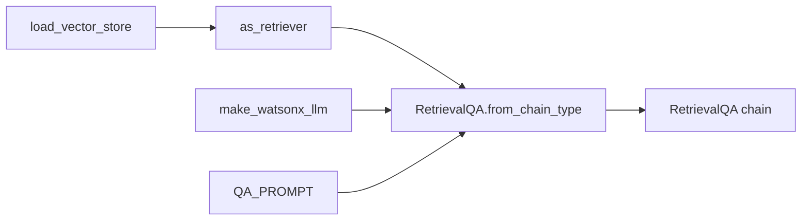
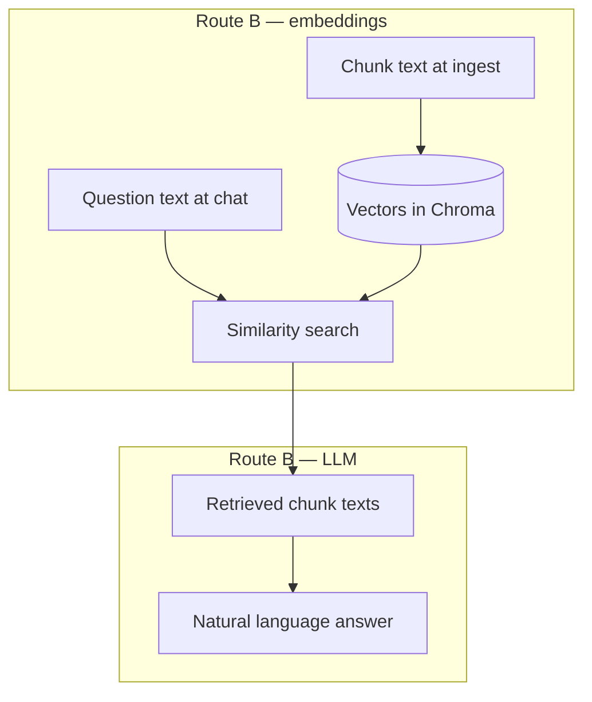
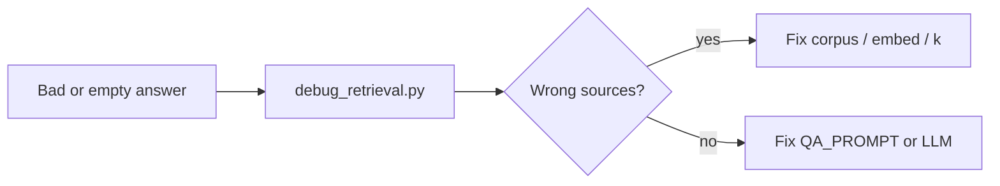

# Capstone 01B — Chat flow (`capstone_01_chat.py`)

← [Capstone overview](capstone01.md) · Ingest flow: [`capstone_01_ingest_flow.md`](capstone_01_ingest_flow.md) · Shared: [`capstone_shared.py`](capstone_shared.py)

**One sentence:** Open the filing cabinet Chroma already has, retrieve the best chunk cards for your question, stuff them into a strict prompt, and let Watsonx answer — or abstain if the corpus does not cover it.

---

## Big picture



**No ingest in chat.** If `chroma_01` is missing, the script exits with a friendly message.

---

## `main()` — startup and question loop



| Mode | Command |
|------|---------|
| One-shot | `python capstone_01_chat.py "What is RAG?"` |
| REPL | `python capstone_01_chat.py` then type questions |

---

## Inside `qa.invoke(question)` — the real RAG chain

You do **not** call the retriever yourself in chat code. `RetrievalQA` orchestrates this:



### Retrieval settings (must match debug)

```python
search_type="mmr"
search_kwargs={"k": 5, "fetch_k": 20}
```

| Param | Meaning |
|-------|---------|
| `fetch_k=20` | Pull 20 candidates by similarity |
| `mmr` | Re-rank for diversity (fewer duplicate noisy chunks) |
| `k=5` | Stuff 5 chunks into the prompt |

**Troubleshoot retrieval without the LLM:** [`debug_retrieval.py`](debug_retrieval.py)

---

## Soft reject vs hard reject

There is **no** pre-filter that blocks “What is the capital of France?” before `invoke`.



| Question type | Retrieval | Answer |
|---------------|-----------|--------|
| In corpus (RAG, DPR, agents…) | Relevant chunks | Grounded answer |
| Out of corpus (France, World Cup) | Irrelevant k chunks | **Abstain** (prompt rule) |
| Gibberish | Random weak chunks | Abstain |

**Rejection happens at generation time**, not before embed/search.

---

## `build_qa_chain()` — what you wire together



| Piece | Source | Role |
|-------|--------|------|
| Vector store | `capstone_shared.load_vector_store()` | Open persisted Chroma |
| Embeddings | Same `EMBED_PARAMS` as ingest | Comparable query vectors |
| Retriever | `vector_store.as_retriever(...)` | Question → chunk texts |
| LLM | `watson_llm.make_watsonx_llm` | Reads context + question |
| Prompt | `QA_PROMPT` | Faithfulness + abstain rules |
| Chain type | `"stuff"` | All k chunks in one prompt |

---

## QA_PROMPT — behavior contract

The prompt teaches the model **how** to use retrieved text:

1. Answer **one** user question only.
2. Use **only** relevant passages; ignore noise (e.g. DPR example Q&A tables).
3. Do **not** echo example questions from papers.
4. Do **not** ask follow-up questions.
5. If nothing helps → say indexed papers do not cover it.

**Generation is typo-tolerant** once good chunks arrive. **Retrieval is not** — mild typos may still hit; bad typos need query rewrite (future pattern).

---

## What chat does *not* do

| Not in Script B | Why |
|-----------------|-----|
| Ingest / chunk / manifest | Script A |
| `return_source_documents=True` | Stretch — cite PDF/page in output |
| Query rewrite for typos | Optional pre-step before `invoke` |
| Score threshold pre-reject | Optional — skip LLM if similarity too low |

---

## Data flow — one question end-to-end

```
User: "How does LangChain describe agents?"
         │
         ▼
embed_query (full question text, capstone EMBED_PARAMS)
         │
         ▼
Chroma: compare query vector to ~787 stored chunk vectors
         │
         ▼
MMR picks 5 (e.g. agents HTML + langchain-paper chunks)
         │
         ▼
context = chunk1 + chunk2 + … + chunk5
         │
         ▼
QA_PROMPT(context, question) → Watsonx (temp 0.2, max 512 tokens)
         │
         ▼
"LangChain describes agents as model + harness …"
```

---

## Function map (quick reference)

```
main()
├── require_chroma_data()     → chroma_has_data() or exit
├── build_qa_chain()
│   ├── load_vector_store()
│   ├── as_retriever(mmr, k=5)
│   └── RetrievalQA.from_chain_type(stuff, QA_PROMPT)
└── ask(qa, question)
    └── qa.invoke(question) → result string
```

---

## LLM vs embedding — two models, two jobs



| Model | When | Input | Output |
|-------|------|-------|--------|
| **Embedding** (slate-125m…) | Ingest + each question | Text | Vector |
| **LLM** (Mistral Small…) | Each answer | Prompt with context | Prose |

RAG works with a **smaller LLM** when retrieval is good and questions are extractive. Strict abstain + noisy chunks favor a capable model.

---

## Run order

```powershell
D:\py_venv\rag_application_builder_foundation\set_env.ps1
cd D:\Workarea\learning\playground\langchain\capstone

# Ingest first (if not done)
python capstone_01_ingest.py --corpus

# Chat
python capstone_01_chat.py "What is dense passage retrieval?"
python capstone_01_chat.py
```

Debug retrieval only:

```powershell
python debug_retrieval.py "How does LangChain describe agents?"
```

---

## Traps

| Symptom | Layer | Fix |
|---------|-------|-----|
| No vector store | Setup | Run ingest `--corpus` |
| “Not covered” for in-corpus topic | Retrieval | `debug_retrieval.py` — wrong top-k? |
| Ireland / random Q&A in answer | Prompt + retrieval | QA_PROMPT rules; MMR k; DPR noise |
| Same chunks every question | Embeddings | `EMBED_PARAMS` + re-ingest `--force` |
| France answers hallucinated | Prompt | Should abstain — tighten prompt if not |

---

## Troubleshooting habit (retrieval first)



1. Run `debug_retrieval.py` with the same question.
2. If `[1]–[5]` are wrong → ingest, embed params, or corpus gap.
3. If `[1]–[5]` are right → prompt or LLM behavior.

---

## Related

- Ingest flow: [`capstone_01_ingest_flow.md`](capstone_01_ingest_flow.md)
- Shared paths + embed: [`capstone_shared.py`](capstone_shared.py)
- Corpus: [`corpus_sources.json`](corpus_sources.json)