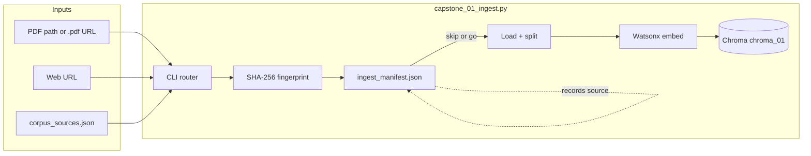
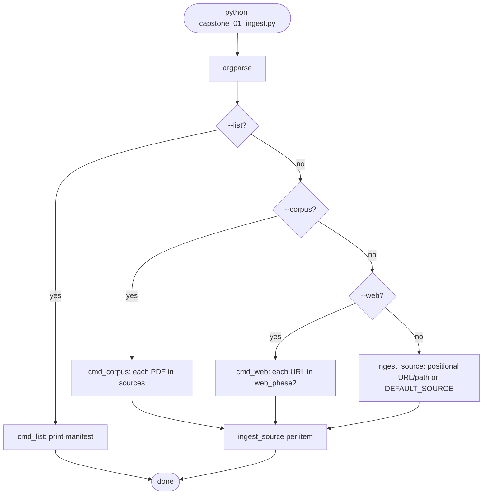
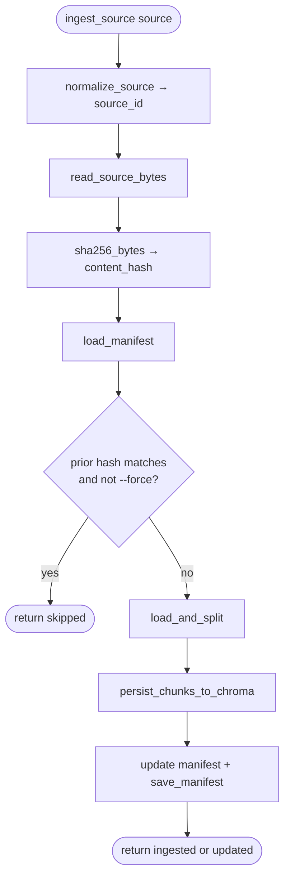
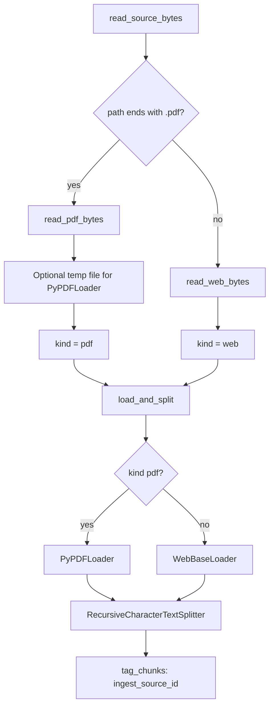
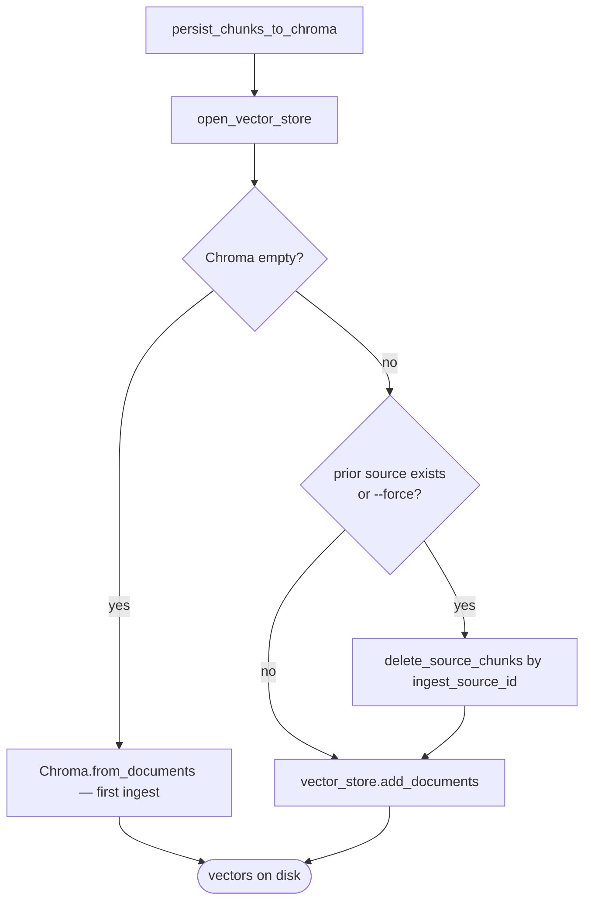
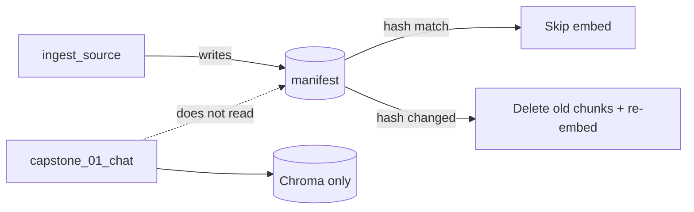

# Capstone 01A — Ingest flow (`capstone_01_ingest.py`)

← [Capstone overview](capstone01.md) · Shared: [`capstone_shared.py`](capstone_shared.py)

**One sentence:** Librarian scans each PDF or web page once, fingerprints it in a ledger, chunks it, embeds it, and files vectors in Chroma — skipping work when nothing changed.

---

## Big picture



**Run once (or when corpus changes).** Chat reads the cabinet later — it does not re-ingest.

---

## CLI router — which path runs?



| Command | What it ingests |
|---------|-----------------|
| `python capstone_01_ingest.py` | Default LangChain course PDF |
| `python capstone_01_ingest.py <url-or-path>` | One PDF or one web page |
| `python capstone_01_ingest.py --corpus` | All PDFs in `corpus_sources.json` → `sources` |
| `python capstone_01_ingest.py --web` | All HTML URLs in `web_phase2` |
| `python capstone_01_ingest.py --list` | Show manifest only (no embed) |
| `--force` (with any ingest) | Re-embed even if hash unchanged |

---

## Core pipeline — `ingest_source()` step by step

This is the heart of Script A. Every CLI path ends here (except `--list`).



### Step detail (study order)

| Step | Function | What happens |
|------|----------|--------------|
| 1 | `normalize_source` | URL stays as-is; local path → absolute path |
| 2 | `read_source_bytes` | PDF: bytes + temp file path. Web: HTML bytes for hash |
| 3 | `sha256_bytes` | Fingerprint raw bytes — dedupe key |
| 4 | `load_manifest` | Read ledger from `data/ingest_manifest.json` |
| 5 | Skip check | Same hash + no `--force` → **no embed, no Chroma touch** |
| 6 | `load_and_split` | Documents → chunks (500 chars, 50 overlap) |
| 7 | `persist_chunks_to_chroma` | Embed + write vectors |
| 8 | `save_manifest` | Record title, kind, hash, chunk_count, timestamp |

---

## PDF vs web — loader branch



**Detection rule:** URL path ends with `.pdf` → PDF. Otherwise → web (e.g. LangChain agents HTML).

---

## Chroma persist — create, append, replace



### What Chroma stores per chunk

| Field | Contents | Used for |
|-------|----------|----------|
| **Embedding** | Full float vector from Watsonx | Similarity search |
| **Document** | Full chunk text (`page_content`) | LLM context in chat |
| **Metadata** | `ingest_source_id`, `page`, PDF fields… | Source labels, delete-by-source |

**`--force` does not duplicate:** delete all rows for that `ingest_source_id`, then add fresh chunks.

---

## Manifest — the dedupe ledger

**Path:** `data/ingest_manifest.json`



Chat never opens the manifest. It only needs Chroma. The manifest is for **you** and ingest skip logic.

---

## Shared config (`capstone_shared.py`)

Both ingest and chat import the same embedding factory — **critical for search quality.**

| Constant | Value | Role |
|----------|-------|------|
| `CHROMA_DIR` | `data/chroma_01` | On-disk vector store |
| `CHUNK_SIZE` / `CHUNK_OVERLAP` | 500 / 50 | Splitter settings |
| `EMBED_PARAMS` | Watsonx, **no** `TRUNCATE_INPUT_TOKENS: 3` | Full-text embed at ingest |
| `METADATA_SOURCE_KEY` | `ingest_source_id` | Delete + filter by source |

**Trap (course vs capstone):** Labs use `TRUNCATE_INPUT_TOKENS: 3` for tiny demos. Capstone must embed **full** chunk text and full questions (via same params at query time). If you change `EMBED_PARAMS`, run `--corpus --force` to rebuild vectors.

---

## Function map (quick reference)

```
main()
├── --list      → cmd_list()
├── --corpus    → cmd_corpus() → ingest_source() × N
├── --web       → cmd_web()    → ingest_source() × N
└── positional  → ingest_source()

ingest_source()
├── read_source_bytes()
├── load_and_split()
│   ├── PyPDFLoader  OR  WebBaseLoader
│   ├── make_splitter()
│   └── tag_chunks()
└── persist_chunks_to_chroma()
    ├── make_embedding_model()  ← capstone_shared
    ├── delete_source_chunks()  (if update/force)
    └── add_documents() / from_documents()
```

---

## Run order (copy-paste)

```powershell
D:\py_venv\rag_application_builder_foundation\set_env.ps1
cd D:\Workarea\learning\playground\langchain\capstone

python capstone_01_ingest.py --corpus
python capstone_01_ingest.py "https://docs.langchain.com/oss/python/langchain/agents"
python capstone_01_ingest.py --list
```

After changing embed settings:

```powershell
python capstone_01_ingest.py --corpus --force
```

---

## Traps

| Symptom | Likely cause | Fix |
|---------|--------------|-----|
| Chat has nothing to search | Ingest never run | `--corpus` then `--list` |
| Same wrong chunks for every question | Truncated embed params + old vectors | Fix `EMBED_PARAMS`, `--force` |
| Duplicate LangChain chunks | Same PDF ingested under two URLs/paths | One canonical `source_id`; delete stale rows |
| `--force` still feels “stale” | Only re-ingested one source | `--corpus --force` for all PDFs |
| Web ingest fails | Bad URL or network | Check URL in browser; `set_env.ps1` |

---

## Related

- Chat flow: [`capstone_01_chat_flow.md`](capstone_01_chat_flow.md)
- Debug retrieval (no LLM): [`debug_retrieval.py`](debug_retrieval.py)
- Corpus list: [`corpus_sources.json`](corpus_sources.json)